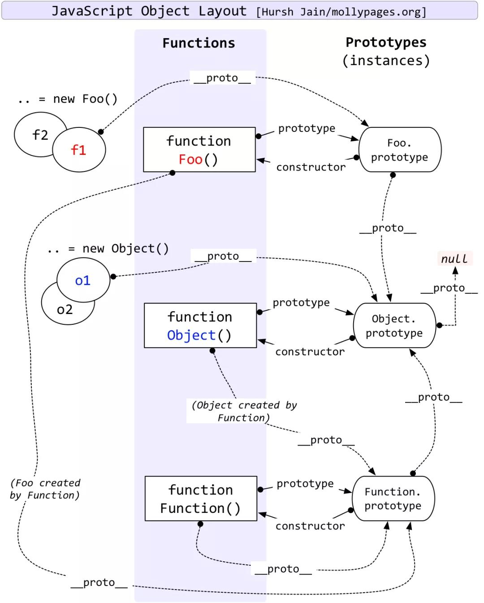

- 原型链

> a prototype may have a non-null implicit reference to its prototype, and so on; this is called the prototype chain.



- prototype定义

**object that provides shared properties for other objects**

1. 所有object对象都有一个隐式引用__proto__

- 原型继承

指设置某个对象为另一个对象的原型（塞进该对象的隐式引用位置）

1. 显示原型继承

```js
const obj_a = { a: 1}
const pbj_b = { b: 2}

Object.setPrototypeOf(obj_b, obj_a); // 将obj_a设置为obj_b的原型
const obj_c = Object.create(obj_b) // 将obj_b作为创建obj_c对象时的原型
```

2. 隐式原型继承

```js
const a = { b: 1}

// 等同于

const a = {};
a.__proto__ = Object.prototype
```